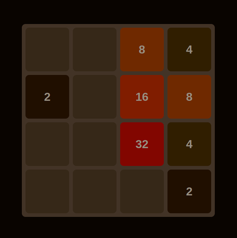

# 2048 Game

This is a simple implementation of the popular 2048 game using HTML, CSS, and JavaScript. The objective of the game is to combine tiles with the same value to reach the 2048 tile.

## How to Play

- Use the arrow keys (`↑`, `↓`, `←`, `→`) to move the tiles in the corresponding direction.
- When two tiles with the same value collide, they merge into one, and the value is doubled.
- The goal is to create a tile with the value `2048`. Once you achieve that, you win the game!
- If there are no more valid moves and the grid is full, the game is over.

## Files

- **index.html**: The HTML structure of the game.
- **2048.js**: The JavaScript logic behind the game.

## Features

- **Responsive Design**: The game board will adjust to the screen size for optimal play on desktop or mobile.
- **Tile Merging**: Tiles combine when they have the same value.
- **Game Over**: When no more valid moves are possible, a game over message will be displayed.
- **Random Tile Generation**: A new tile (`2` or `4`) is generated after each move.

## Instructions

1. Download the repository or copy the code to your local machine.
2. Open `index.html` in your preferred web browser.
3. Start playing the game using the arrow keys!

## Screenshots

## License

This project is licensed under the MIT License - see the [LICENSE](LICENSE) file for details.
